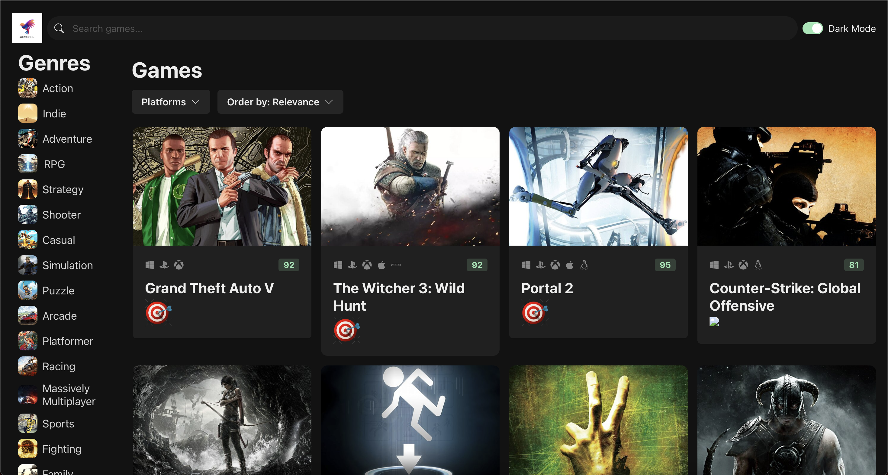

# Game Store

A responsive **game discovery platform** built with **React, TypeScript, and Chakra UI**.  
Browse and discover games by genre, platform, and popularity — powered by a third-party REST API.  

## Features

- **Modern UI**: Dark theme design with Chakra UI for responsive layout.
- **Dynamic Game Data**: Integrated third-party REST API using Axios.
- **Filtering & Sorting**: 
  - Filter by **genre** (Action, Adventure, RPG, etc.)
  - Select platforms (**PC, PlayStation, Xbox, Mobile**)
  - Sort by **relevance, popularity, or rating**
- **Performance Optimized**: Efficient API calls and smooth UI rendering.

---

## Screenshots

> __

---

## Tech Stack

- **Frontend**: React, TypeScript, Chakra UI  
- **HTTP Client**: Axios  
- **API**: Third-party Game REST API  

---

## Installation

1. Clone the repository:
   ```bash
   git clone https://github.com/your-username/game-store.git
   cd game-store
2. Install Dependencies
    ```bash
    npm install
3. Create an .env file in the root directory and add your API key:
    ```
    VITE_API_KEY=your_api_key_here
4. Start the development server:
    ```
    npm run dev
